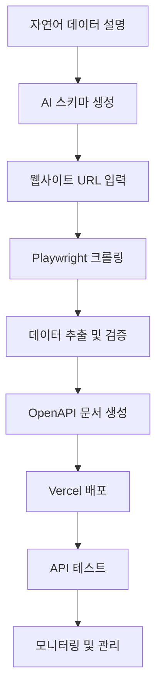

# VibePloy - Vision-First 웹 크롤링 API 자동 생성 플랫폼

[](https://nextjs.org/)
[](https://www.typescriptlang.org/)
[](https://tailwindcss.com/)
[](https://github.com/magnitudedev/magnitude)

VibePloy는 [Magnitude](https://github.com/magnitudedev/magnitude) 스타일의 vision-first 접근 방식을 활용하여 자연어 설명만으로 웹 크롤링 API를 자동으로 생성하고 배포할 수 있는 혁신적인 플랫폼입니다. CSS 셀렉터에 의존하지 않고 시각적 AI를 통해 진정한 일반화된 웹 자동화를 제공합니다.

## 🚀 주요 기능

### 1. Vision-First API 생성 (Magnitude 스타일)
- **시각적 AI 기반**: CSS 셀렉터 없이 시각적 요소 설명으로 스키마 생성
- **OpenAI Vision API**: 스크린샷 분석을 통한 지능형 요소 인식
- **DOM 구조 독립적**: 웹사이트 구조 변경에 강건한 진정한 일반화
- **자연어 액션**: "로그인 버튼을 클릭하세요" 같은 자연어 명령 지원

### 2. 지능형 브라우저 자동화 & 데이터 추출
- **Playwright + Vision AI**: 시각적 요소 인식 기반 브라우저 제어
- **자연어 액션 시퀀스**: 복잡한 사용자 워크플로우 자동화
- **동적 콘텐츠 처리**: SPA 및 JavaScript 렌더링 콘텐츠 지원
- **적응형 추출**: 페이지 구조 변경에도 안정적인 데이터 추출
- **멀티모달 인텔리전스**: 텍스트와 이미지를 모두 이해하는 AI

### 3. 자동 API 문서화 & 배포
- **OpenAPI (Swagger) 자동 생성**: 완전한 API 문서화
- **인터랙티브 문서**: 실시간 테스트 가능한 API 문서
- **다국어 예제**: JavaScript, Python, cURL 등 다양한 언어 지원
- **Vercel 원클릭 배포**: 환경 변수 관리 및 실시간 로그

### 4. Magnitude 영감 받은 핵심 기능
- **agent.act()**: 고수준 자연어 작업 처리
- **agent.extract()**: zod 스키마 기반 구조화된 데이터 추출  
- **Vision AI 통합**: 인터페이스 이해 및 액션 계획
- **정확한 마우스/키보드 액션**: 픽셀 단위 정밀 제어

### 5. 고급 자동화 기능
- **로그인 자동화**: 복잡한 인증 플로우 처리
- **검색 및 내비게이션**: 다단계 웹사이트 탐색
- **에러 복구**: 실패 시 자동 재시도 및 대안 경로
- **성능 모니터링**: 실시간 API 성능 추적

## 📦 설치 및 실행

### 전제 조건
- Node.js 18+ 설치
- npm 또는 yarn 패키지 매니저

### 설치 방법

```bash
# 프로젝트 클론
git clone https://github.com/your-username/vibeploy.git
cd vibeploy

# 의존성 설치
npm install

# 개발 서버 실행
npm run dev
```

### 환경 변수 설정

프로젝트 루트에 `.env.local` 파일을 생성하고 다음 환경 변수를 설정하세요:

```env
# OpenAI API 키 (Vision API 및 스키마 생성용)
OPENAI_API_KEY=sk-your_openai_key

# Playwright 브라우저 경로
PLAYWRIGHT_BROWSERS_PATH=0

# Vercel 배포 토큰
VERCEL_TOKEN=vercel_your_token

# 선택사항: Firecrawl API (대안 크롤링)
NEXT_PUBLIC_FIRECRAWL_API_KEY=fc-your_key

# 선택사항: Serper API (검색 기능)
SERPER_API_KEY=your_serper_key

# 선택사항: Upstash Redis (캐싱)
UPSTASH_REDIS_REST_URL=https://your-redis-url
UPSTASH_REDIS_REST_TOKEN=your_redis_token
```

## 🎯 사용 방법

### 1. 웹 크롤링 API 생성

1. **데이터 설명**: 원하는 데이터를 자연어로 설명합니다.
   ```
   예: "웹사이트에서 상품명, 가격, 이미지 URL, 평점을 추출하고 싶습니다."
   ```

2. **스키마 생성**: AI가 자동으로 JSON 스키마를 생성합니다.
   ```json
   {
     "type": "object",
     "properties": {
       "title": { "type": "string", "description": "상품명" },
       "price": { "type": "string", "description": "가격" },
       "image": { "type": "string", "description": "이미지 URL" },
       "rating": { "type": "number", "description": "평점" }
     }
   }
   ```

3. **URL 입력**: 크롤링할 웹사이트 URL을 입력합니다.

4. **데이터 추출**: 자동으로 데이터를 추출하고 결과를 확인합니다.

### 2. API 문서 생성

생성된 API에 대한 OpenAPI 문서가 자동으로 생성됩니다:

```javascript
// JavaScript 사용 예제
const response = await fetch('https://your-api.vercel.app/api/scrape', {
  method: 'GET',
  headers: {
    'Authorization': 'Bearer YOUR_API_KEY',
    'Content-Type': 'application/json'
  }
});

const data = await response.json();
console.log(data);
```

### 3. 배포 및 관리

1. **환경 변수 설정**: 필요한 API 키들을 입력합니다.
2. **배포 실행**: Vercel에 원클릭 배포합니다.
3. **모니터링**: 배포 상태와 API 성능을 모니터링합니다.

## 🏗️ 프로젝트 구조

```
vibeploy/
├── src/
│   ├── app/
│   │   ├── components/           # React 컴포넌트
│   │   │   ├── WebScrapingInterface.tsx
│   │   │   ├── ApiDocumentation.tsx
│   │   │   └── DeploymentSection.tsx
│   │   ├── api/                 # API 엔드포인트
│   │   │   ├── generate-schema/ # AI 스키마 생성
│   │   │   ├── extract-data/    # 웹 크롤링 실행
│   │   │   ├── generate-swagger/ # API 문서 생성
│   │   │   ├── deploy/          # 배포 관리
│   │   │   └── test/           # API 테스트
│   │   ├── globals.css         # 전역 스타일
│   │   ├── layout.tsx          # 레이아웃
│   │   └── page.tsx            # 메인 페이지
│   └── ...
├── public/                     # 정적 파일
├── package.json
└── README.md
```

## 🌟 기술 스택

### 🎯 핵심 기술 (Magnitude 영감)
- **Vision AI**: OpenAI GPT-4o
- **브라우저 자동화**: Playwright + Vision AI
- **자연어 처리**: OpenAI GPT-4o
- **DOM 독립적 아키텍처**: 시각적 요소 인식 기반

### 🛠️ 개발 스택
- **Frontend**: Next.js 15, React 19, TypeScript, TailwindCSS
- **Backend**: Next.js API Routes, Node.js
- **AI/ML**: OpenAI API (GPT-4, Vision API)
- **브라우저 엔진**: Playwright, Chromium
- **배포**: Vercel, Vercel CLI
- **문서화**: OpenAPI/Swagger, 자동 생성
- **캐싱**: Upstash Redis (선택사항)
- **검색**: Serper API (선택사항)

## 📊 워크플로우



## 🔧 API 엔드포인트

### 내부 API

| 엔드포인트 | 메서드 | 설명 |
|-----------|-------|------|
| `/api/generate-schema` | POST | 자연어 설명을 JSON 스키마로 변환 |
| `/api/extract-data` | POST | 웹사이트에서 데이터 추출 |
| `/api/generate-swagger` | POST | OpenAPI 문서 생성 |
| `/api/deploy` | POST | Vercel 배포 실행 |
| `/api/test` | GET/POST | API 테스트 실행 |

### 생성된 API

| 엔드포인트 | 메서드 | 설명 |
|-----------|-------|------|
| `/api/scrape` | GET | 웹 데이터 크롤링 |
| `/api/health` | GET | API 상태 확인 |
| `/api/docs` | GET | API 문서 (HTML) |

## 🛡️ 보안 및 인증

- Bearer Token 기반 API 인증
- 요청 제한 (Rate Limiting)
- CORS 설정
- 환경 변수 보안 관리

## 📈 성능 최적화

- 응답 캐싱
- 병렬 크롤링 처리
- 메모리 최적화
- CDN 활용

## 🚀 배포 가이드

### Vercel 배포

1. Vercel CLI 설치:
   ```bash
   npm install -g vercel
   ```

2. 프로젝트 배포:
   ```bash
   vercel --prod
   ```

3. 환경 변수 설정:
   ```bash
   vercel env add OPENAI_API_KEY
   ```

### 환경별 설정

- **Development**: `localhost:3000`
- **Staging**: `staging.vibeploy.vercel.app`
- **Production**: `vibeploy.vercel.app`

## 🤝 기여하기

1. Fork 프로젝트
2. Feature 브랜치 생성 (`git checkout -b feature/AmazingFeature`)
3. 변경사항 커밋 (`git commit -m 'Add some AmazingFeature'`)
4. 브랜치에 Push (`git push origin feature/AmazingFeature`)
5. Pull Request 생성

## 📝 라이선스

이 프로젝트는 MIT 라이선스 하에 배포됩니다. 자세한 내용은 `LICENSE` 파일을 참조하세요.

## 🙏 감사의 말

- [**Magnitude**](https://github.com/magnitudedev/magnitude) - Vision-first 브라우저 자동화 아키텍처 영감
- [Firecrawl](https://www.firecrawl.dev/) - 웹 크롤링 참고 구현
- [OpenAI](https://openai.com/) - Vision API 및 자연어 처리
- [Vercel](https://vercel.com/) - 서버리스 호스팅 플랫폼
- [Next.js](https://nextjs.org/) - 풀스택 React 프레임워크
- [Playwright](https://playwright.dev/) - 신뢰성 높은 브라우저 자동화

## 📞 문의

프로젝트에 대한 질문이나 제안이 있으시면 언제든지 연락주세요:

- 이메일: contact@vibeploy.com
- GitHub Issues: [Issues 페이지](https://github.com/your-username/vibeploy/issues)
- Twitter: [@VibePloy](https://twitter.com/VibePloy)

---

**VibePloy와 함께 웹 크롤링의 미래를 경험해보세요! 🚀**
