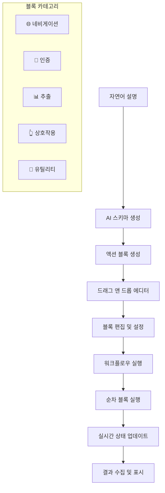

# VibePloy - 드래그 앤 드롭 웹 크롤링 워크플로우 플랫폼

[](https://nextjs.org/)
[](https://www.typescriptlang.org/)
[](https://tailwindcss.com/)
[](https://playwright.dev/)

VibePloy는 자연어 설명을 **드래그 앤 드롭 가능한 워크플로우**로 변환하여 웹 크롤링 API를 자동으로 생성하고 배포할 수 있는 혁신적인 플랫폼입니다. 시각적 블록 에디터를 통해 복잡한 웹 자동화 작업을 직관적으로 구성할 수 있습니다.

## 🚀 주요 기능

### 1. 🎨 드래그 앤 드롭 워크플로우 에디터
- **비주얼 블록 시스템**: 액션을 블록으로 시각화하여 직관적인 워크플로우 구성
- **실시간 드래그 앤 드롭**: 블록을 드래그하여 실행 순서 자유롭게 변경
- **카테고리별 색상 구분**: 네비게이션(파란색), 인증(노란색), 추출(초록색), 상호작용(보라색), 유틸리티(회색)
- **확장/축소 가능한 블록**: 복잡한 워크플로우도 깔끔하게 관리

### 2. 🔧 스마트 액션 블록 시스템
- **🌐 네비게이션 블록**: 페이지 이동, 로딩 대기
- **🔐 인증 블록**: 로그인, CAPTCHA, OTP, 쿠키 동의 (옵셔널)
- **📊 추출 블록**: 텍스트, 링크, 이미지, 테이블 데이터 추출
- **👆 상호작용 블록**: 클릭, 텍스트 입력, 폼 작성, 스크롤
- **🔧 유틸리티 블록**: 스크린샷, 대기, 조건부 실행

### 3. ⚙️ 실시간 편집 및 검증
- **인라인 편집**: 각 액션을 클릭하여 즉시 편집
- **타입별 맞춤 필드**: 액션 타입에 따른 동적 입력 필드
- **실시간 유효성 검사**: CSS 셀렉터 및 설정값 검증
- **대체 셀렉터 지원**: 메인 셀렉터 실패 시 자동 대체

### 4. 🎯 AI 기반 스키마 생성
- **자연어 → 워크플로우**: 설명만으로 완전한 워크플로우 자동 생성
- **CSS 셀렉터 감지**: 설명에서 셀렉터 자동 추출 및 매핑
- **OpenAI GPT-4o 통합**: 고도화된 자연어 처리 및 스키마 생성
- **스키마 + 액션 블록**: 데이터 스키마와 실행 블록을 함께 생성

### 5. 🔄 프론트엔드 제어 방식
- **클라이언트 실행**: 모든 워크플로우를 프론트엔드에서 순차 실행
- **실시간 진행 상황**: 각 블록의 실행 상태를 실시간으로 표시
- **수동 개입 지원**: CAPTCHA, 로그인 등 수동 처리 필요 시 사용자 개입
- **에러 핸들링**: 실패한 블록 재시도 및 대체 경로 실행

### 6. 📋 액션 블록 템플릿 시스템
- **15개 사전 정의 템플릿**: 일반적인 웹 자동화 작업을 위한 템플릿
- **드래그 앤 드롭 추가**: 템플릿을 워크플로우에 쉽게 추가
- **설정 가능한 필드**: 각 템플릿의 필드를 사용자 환경에 맞게 조정
- **아이콘 및 설명**: 시각적으로 구분 가능한 템플릿 관리

## 📦 설치 및 실행

### 전제 조건
- Node.js 18+ 설치
- npm 또는 yarn 패키지 매니저

### 설치 방법

```bash
# 프로젝트 클론
git clone https://github.com/your-username/vibeploy.git
cd vibeploy

# 의존성 설치
npm install

# 개발 서버 실행
npm run dev
```

### 환경 변수 설정

프로젝트 루트에 `.env.local` 파일을 생성하고 다음 환경 변수를 설정하세요:

```env
# OpenAI API 키 (필수 - 스키마 생성 및 워크플로우 생성용)
OPENAI_API_KEY=sk-your_openai_key

# Upstash Redis (선택사항 - 캐싱 및 API 키 관리)
UPSTASH_REDIS_REST_URL=https://your-redis-url
UPSTASH_REDIS_REST_TOKEN=your_redis_token

# Vercel 배포 토큰 (선택사항 - 자동 배포용)
VERCEL_TOKEN=vercel_your_token
```

## 🎯 사용 방법

### 1. 워크플로우 생성

1. **자연어 설명 입력**:
   ```
   예: "네이버 쇼핑에서 상품명, 가격, 이미지를 추출하고 싶습니다."
   ```

2. **자동 워크플로우 생성**: AI가 다음을 자동으로 생성합니다:
   - 📊 데이터 스키마 (JSON)
   - 🎨 액션 블록들 (드래그 앤 드롭 가능)
   - 🔗 블록 간 연결 관계

3. **워크플로우 편집**:
   - 블록을 드래그하여 순서 변경
   - 각 액션 클릭하여 셀렉터 및 설정 수정
   - 불필요한 블록 비활성화 또는 삭제

### 2. 블록 편집 및 설정

```javascript
// 예시: 생성된 워크플로우 구조
{
  "schema": {
    "type": "object",
    "properties": {
      "title": { "type": "string", "selector": ".product-title" },
      "price": { "type": "string", "selector": ".price" },
      "image": { "type": "string", "selector": "img.product-image", "attribute": "src" }
    }
  },
  "actionBlocks": [
    {
      "id": "nav-block",
      "title": "페이지 이동",
      "category": "navigation",
      "actions": [
        { "type": "navigate", "url": "{{url}}" },
        { "type": "wait", "duration": 3000 }
      ]
    },
    {
      "id": "extract-block", 
      "title": "데이터 추출",
      "category": "extraction",
      "actions": [
        { "type": "extract", "field": "title", "selector": ".product-title" },
        { "type": "extract", "field": "price", "selector": ".price" }
      ]
    }
  ]
}
```

### 3. 실행 및 테스트

1. **URL 입력**: 크롤링할 웹사이트 URL 입력
2. **워크플로우 실행**: 각 블록이 순차적으로 실행
3. **실시간 모니터링**: 블록별 실행 상태 확인
4. **결과 확인**: 추출된 데이터 검증

## 🏗️ 프로젝트 구조

```
vibeploy/
├── src/
│   ├── app/
│   │   ├── components/           # React 컴포넌트
│   │   │   └── WebScrapingInterface.tsx  # 메인 워크플로우 에디터
│   │   ├── api/                 # API 엔드포인트
│   │   │   ├── generate-schema/ # AI 스키마 + 워크플로우 생성
│   │   │   ├── extract-data/    # 간단한 인증 처리
│   │   │   ├── action-templates/ # 액션 블록 템플릿
│   │   │   ├── deploy/          # 배포 관리
│   │   │   ├── results/         # 결과 조회
│   │   │   └── routes/          # 라우트 관리
│   │   └── ...
│   ├── lib/
│   │   ├── types.ts             # 타입 정의 (워크플로우, 액션 블록)
│   │   ├── redis.ts             # Redis 연동
│   │   └── utils.ts             # 유틸리티 함수
│   └── ...
├── public/                      # 정적 파일
├── package.json
└── README.md
```

## 🌟 기술 스택

### 🎯 핵심 기술
- **워크플로우 엔진**: 커스텀 드래그 앤 드롭 시스템
- **AI 엔진**: OpenAI GPT-4o (스키마 생성 및 자연어 처리)
- **실행 엔진**: 프론트엔드 기반 순차 실행
- **상태 관리**: React Hooks (useState, useEffect)

### 🛠️ 개발 스택
- **Frontend**: Next.js 15, React 19, TypeScript
- **UI/UX**: TailwindCSS, Lucide Icons, 드래그 앤 드롭 API
- **Backend**: Next.js API Routes, Node.js
- **데이터베이스**: Upstash Redis (캐싱 및 상태 관리)
- **AI/ML**: OpenAI API (GPT-4o)
- **배포**: Vercel

## 📊 워크플로우 아키텍처



## 🔧 API 엔드포인트

### 워크플로우 생성 API

| 엔드포인트 | 메서드 | 설명 |
|-----------|-------|------|
| `/api/generate-schema` | POST | 자연어 → 스키마 + 액션 블록 생성 |
| `/api/action-templates` | GET | 사용 가능한 액션 블록 템플릿 조회 |
| `/api/execute-workflow` | POST | 워크플로우 실행 및 데이터 추출 |

### 배포 관리 API

| 엔드포인트 | 메서드 | 설명 |
|-----------|-------|------|
| `/api/deploy` | POST/GET/DELETE | API 배포 관리 |
| `/api/results/{id}` | GET | 실행 결과 조회 |
| `/api/routes` | GET | 배포된 라우트 목록 |

## 🎨 액션 블록 템플릿

### 네비게이션 템플릿
- **페이지 이동**: URL 이동 + 로딩 대기
- **새 탭 열기**: 새 탭에서 페이지 열기

### 인증 템플릿 (옵셔널)
- **로그인**: 사용자명/비밀번호 입력
- **CAPTCHA**: CAPTCHA 해결 대기
- **쿠키 동의**: 쿠키 동의 팝업 처리

### 상호작용 템플릿
- **검색**: 검색어 입력 + 검색 실행
- **폼 입력**: 다양한 폼 필드 입력
- **버튼 클릭**: 특정 버튼 클릭
- **스크롤**: 페이지 스크롤

### 추출 템플릿
- **텍스트 추출**: 텍스트 콘텐츠 추출
- **링크 추출**: 링크 URL 추출
- **이미지 추출**: 이미지 소스 추출
- **테이블 추출**: 테이블 데이터 추출

### 유틸리티 템플릿
- **대기**: 시간 또는 요소 대기
- **스크린샷**: 페이지 스크린샷 촬영
- **조건부 실행**: 조건에 따른 분기 실행

## 🛡️ 보안 및 성능

### 보안
- API 키 기반 인증
- Redis를 통한 안전한 키 관리
- 클라이언트 사이드 실행으로 서버 부하 최소화

### 성능
- 프론트엔드 기반 실행으로 확장성 확보
- Redis 캐싱으로 빠른 응답
- 병렬 블록 실행 지원

## 🚀 배포 가이드

### Vercel 배포

1. **프로젝트 배포**:
   ```bash
   vercel --prod
   ```

2. **환경 변수 설정**:
   ```bash
   vercel env add OPENAI_API_KEY
   vercel env add UPSTASH_REDIS_REST_URL
   vercel env add UPSTASH_REDIS_REST_TOKEN
   ```

3. **도메인 설정**:
   ```bash
   vercel domains add your-domain.com
   ```

## 🤝 기여하기

1. Fork 프로젝트
2. Feature 브랜치 생성 (`git checkout -b feature/AmazingFeature`)
3. 변경사항 커밋 (`git commit -m 'Add some AmazingFeature'`)
4. 브랜치에 Push (`git push origin feature/AmazingFeature`)
5. Pull Request 생성

## 📝 라이선스

이 프로젝트는 MIT 라이선스 하에 배포됩니다. 자세한 내용은 `LICENSE` 파일을 참조하세요.

## 🙏 감사의 말

- [OpenAI](https://openai.com/) - GPT-4o API 및 자연어 처리
- [Vercel](https://vercel.com/) - 서버리스 호스팅 플랫폼
- [Next.js](https://nextjs.org/) - 풀스택 React 프레임워크
- [TailwindCSS](https://tailwindcss.com/) - 유틸리티 퍼스트 CSS 프레임워크
- [Lucide](https://lucide.dev/) - 아름다운 아이콘 라이브러리
- [Upstash](https://upstash.com/) - 서버리스 Redis 서비스

## 📞 문의

프로젝트에 대한 질문이나 제안이 있으시면 언제든지 연락주세요:

- 이메일: contact@vibeploy.com
- GitHub Issues: [Issues 페이지](https://github.com/your-username/vibeploy/issues)
- Twitter: [@VibePloy](https://twitter.com/VibePloy)

---

**VibePloy와 함께 드래그 앤 드롭으로 웹 크롤링 워크플로우를 만들어보세요! 🎨🚀**
